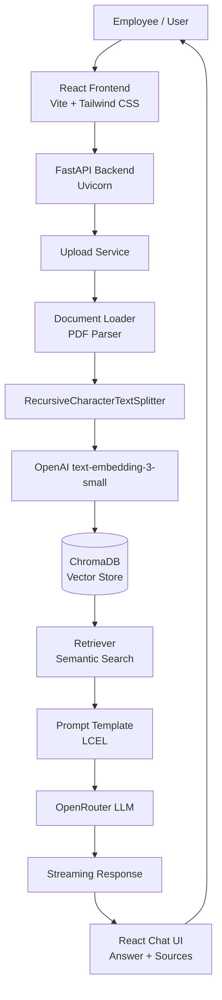
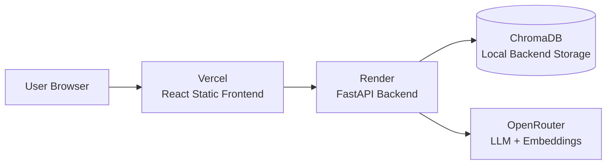

# HR Policy Assistant

> A production-style Retrieval-Augmented Generation application for asking natural-language questions over HR policy PDFs, with semantic retrieval, streaming answers, and source citations.

[](https://react.dev/)
[](https://vite.dev/)
[](https://tailwindcss.com/)
[](https://fastapi.tiangolo.com/)
[](https://www.python.org/)
[](https://www.langchain.com/)
[](https://www.trychroma.com/)
[](https://openrouter.ai/)
[](https://www.docker.com/)
[](https://vercel.com/)
[](https://render.com/)
[](./LICENSE)

## Table Of Contents

- [Project Overview](#project-overview)
- [Live Demo](#live-demo)
- [Screenshots](#screenshots)
- [Key Features](#key-features)
- [Architecture Overview](#architecture-overview)
- [System Workflow](#system-workflow)
- [Technology Stack](#technology-stack)
- [Project Structure](#project-structure)
- [Installation](#installation)
- [Environment Variables](#environment-variables)
- [Usage Guide](#usage-guide)
- [API Overview](#api-overview)
- [Deployment](#deployment)
- [Engineering Decisions](#engineering-decisions)
- [Challenges Solved](#challenges-solved)
- [Known Limitations](#known-limitations)
- [Future Improvements](#future-improvements)
- [Learning Outcomes](#learning-outcomes)
- [License](#license)
- [Author](#author)
- [Acknowledgements](#acknowledgements)

## Project Overview

HR Policy Assistant lets employees upload policy PDFs and ask questions in plain English instead of manually searching long documents. The application converts uploaded files into searchable chunks, stores semantic embeddings in ChromaDB, retrieves the most relevant passages for each question, and generates grounded answers through an OpenRouter-powered language model.

Traditional keyword search is brittle for HR use cases because employees rarely phrase questions the same way a policy is written. Retrieval-Augmented Generation solves that gap by matching meaning instead of exact terms. A question like "How many days off do I get after a family emergency?" can still retrieve sections titled "Bereavement Leave" or "Emergency Leave Policy."

The application is built as a full-stack system:

| Layer | Responsibility |
| --- | --- |
| React + Vite | Chat UI, PDF upload flow, settings, source rendering |
| FastAPI | Upload, indexing, retrieval, generation, streaming APIs |
| LangChain + LCEL | RAG orchestration, prompt composition, retriever flow |
| ChromaDB | Local vector database for embedded document chunks |
| OpenRouter | BYOK access to the configured chat model |
| OpenAI `text-embedding-3-small` | Fixed embedding model for stable vector compatibility |

Source citations are a core part of the experience. HR answers affect real decisions, so the assistant returns supporting document references alongside the response. Conversation memory improves follow-up questions by rewriting context-aware prompts before retrieval, which makes interactions feel closer to a real policy-support workflow.

> [!NOTE]
> This repository is structured like a production engineering project, while still keeping deployment and infrastructure lightweight enough for a portfolio environment.

## Live Demo

| Resource | URL |
| --- | --- |
| Frontend | `https://hr-policy-assistant-gules.vercel.app/` |
| Backend | `https://hr-policy-assistant-b595.onrender.com` |
| Swagger / OpenAPI | `https://hr-policy-assistant-b595.onrender.com/docs` |
| GitHub | `https://github.com/anoopsinghji/hr-policy-assistant` |
| Demo Video | `https://github.com/anoopsinghji/HR-Policy-Assistant` |

## Screenshots

### Home


### Chat


### Upload


### Settings


### Source Citations


### Demo


## Key Features

| Feature | Description |
| --- | --- |
| PDF Upload | Upload HR policy PDFs through the web interface for immediate indexing. |
| Automatic Document Chunking | Uses `RecursiveCharacterTextSplitter` to break long documents into retrieval-friendly text chunks. |
| Vector Embeddings | Converts chunks into semantic vectors using OpenAI `text-embedding-3-small`. |
| Semantic Search | Retrieves policy sections by meaning, not just keyword overlap. |
| ChromaDB | Stores embedded chunks locally with source metadata for fast retrieval. |
| LangChain | Coordinates document loading, retrieval, prompt assembly, and model calls. |
| LCEL | Keeps the RAG pipeline composable and easier to evolve. |
| OpenRouter Integration | Routes chat completions through OpenRouter-compatible OpenAI APIs. |
| Bring Your Own API Key | Users provide their own OpenRouter key from the Settings page. |
| Fixed Embedding Model | Uses one embedding model consistently to avoid vector-space mismatches. |
| Conversation Memory | Sends recent chat history into the retrieval and generation flow for better follow-ups. |
| Streaming Responses | Streams generated answers back to the React UI for a responsive chat experience. |
| Source Citations | Returns the document source and page metadata used to answer a question. |
| Duplicate PDF Detection | Replacing a file with the same name removes stale vectors before re-indexing. |
| Delete Indexed Documents | Users can remove uploaded PDFs and their corresponding vector entries. |
| Automatic Index Rebuild | The backend can rebuild the vector index from the currently uploaded PDFs. |
| Fully Deployed | Designed for a Vercel frontend and Render backend deployment model. |

## Architecture Overview



<details>
<summary>Why this architecture works for HR policy Q&A</summary>

The system separates document ingestion from question answering. Uploads are parsed, chunked, embedded, and stored once. Chat requests then perform lightweight semantic retrieval and generation against the existing vector index.

That separation keeps the chat path fast, avoids reprocessing PDFs on every question, and makes it possible to rebuild or replace the index independently when documents change.

</details>

## System Workflow

| Step | What Happens | Output |
| --- | --- | --- |
| 1. Upload | The employee uploads a PDF from the frontend. | File is sent to `POST /upload`. |
| 2. Validation | The backend accepts PDF files and rejects unsupported formats. | Safe document handoff to the upload service. |
| 3. Chunking | The PDF is loaded and split into overlapping text chunks. | Smaller retrieval units with source metadata. |
| 4. Embedding | Each chunk is embedded with `openai/text-embedding-3-small`. | Dense vectors in a stable embedding space. |
| 5. Storage | Chunks, vectors, and metadata are stored in ChromaDB. | Searchable local knowledge base. |
| 6. Retrieval | User questions are embedded and compared against stored vectors. | Relevant chunks from uploaded policies. |
| 7. Generation | Retrieved context, chat history, and the question are sent to the LLM. | Natural-language answer grounded in policy text. |
| 8. Citation | Source metadata is collected from retrieved chunks. | Page-aware citations shown in the UI. |

## Technology Stack

| Category | Technologies |
| --- | --- |
| Frontend | React 19, Vite, Tailwind CSS, Axios, React Markdown, Lucide React |
| Backend | FastAPI, Python, Uvicorn, Pydantic, Python Multipart |
| AI | LangChain, LCEL, OpenRouter, OpenAI-compatible chat API, `text-embedding-3-small` |
| Retrieval | ChromaDB, semantic search, retriever abstraction, source metadata |
| Document Processing | PDF upload pipeline, PDF loader, recursive text splitting |
| Deployment | Vercel frontend, Render backend, Docker, Docker Compose |
| Developer Tools | Git, npm, pip, Swagger/OpenAPI, environment-based configuration |

## Project Structure

```text
hr-policy-assistant/
|-- backend/
|   |-- api/
|   |   |-- __init__.py
|   |   |-- chat.py
|   |   |-- stream.py
|   |   `-- upload.py
|   |-- core/
|   |   |-- config.py
|   |   |-- dependencies.py
|   |   `-- pipeline.py
|   |-- documents/
|   |   `-- IIA HR Policy.pdf
|   |-- rag/
|   |   |-- __init__.py
|   |   |-- embeddings.py
|   |   |-- generator.py
|   |   |-- loader.py
|   |   |-- retriever.py
|   |   |-- splitter.py
|   |   `-- vector_store.py
|   |-- schemas/
|   |   |-- __init__.py
|   |   |-- chat.py
|   |   `-- upload.py
|   |-- services/
|   |   |-- embedding_factory.py
|   |   |-- llm_factory.py
|   |   |-- rag_service.py
|   |   `-- upload_service.py
|   |-- Dockerfile
|   |-- main.py
|   `-- requirements.txt
|-- frontend/
|   |-- public/
|   |   `-- favicon.svg
|   |-- src/
|   |   |-- api/
|   |   |-- components/
|   |   |   |-- Chat/
|   |   |   |-- KnowledgeBase/
|   |   |   |-- Layout/
|   |   |   |-- Settings/
|   |   |   `-- Upload/
|   |   |-- context/
|   |   |-- hooks/
|   |   |-- pages/
|   |   |-- services/
|   |   |-- App.jsx
|   |   |-- index.css
|   |   `-- main.jsx
|   |-- Dockerfile
|   |-- index.html
|   |-- package-lock.json
|   |-- package.json
|   `-- vite.config.js
|-- docs/
|   `-- API.md
|-- assets/
|   |-- demo/
|   |   `-- demo.gif
|   `-- screenshots/
|       |-- chat.png
|       |-- home.png
|       |-- settings.png
|       |-- source-citation.png
|       `-- upload.png
|-- docker-compose.yml
|-- LICENSE
`-- README.md
```

## Installation

### Prerequisites

| Tool | Recommended Version |
| --- | --- |
| Python | `3.11+` |
| Node.js | `20+` |
| npm | `10+` |
| Docker | Latest stable |
| Docker Compose | Latest stable |

### Clone The Repository

```bash
git clone https://github.com/your-username/hr-policy-assistant.git
cd hr-policy-assistant
```

### Backend Setup

```bash
cd backend
python -m venv .venv
source .venv/bin/activate
pip install -r requirements.txt
python -m uvicorn main:app --reload --host 127.0.0.1 --port 8000
```

For Windows PowerShell:

```powershell
cd backend
python -m venv .venv
.\.venv\Scripts\Activate.ps1
pip install -r requirements.txt
python -m uvicorn main:app --reload --host 127.0.0.1 --port 8000
```

The backend will be available at:

```text
http://127.0.0.1:8000
```

Swagger documentation will be available at:

```text
http://127.0.0.1:8000/docs
```

### Frontend Setup

```bash
cd frontend
npm install
npm run dev
```

The frontend will be available at:

```text
http://localhost:5173
```

### Run Locally

Start the backend in one terminal:

```bash
cd backend
python -m uvicorn main:app --reload --host 127.0.0.1 --port 8000
```

Start the frontend in another terminal:

```bash
cd frontend
npm run dev
```

Open the application:

```text
http://localhost:5173
```

### Docker

Build and run the stack:

```bash
docker compose up --build
```

Stop the stack:

```bash
docker compose down
```

### Docker Compose Services

| Service | Container | Port | Purpose |
| --- | --- | --- | --- |
| `backend` | `hr-backend` | `8000` | FastAPI API and RAG pipeline |
| `frontend` | `hr-frontend` | `5173` | Vite React application |

The compose file mounts local backend volumes for uploaded documents and ChromaDB data:

```yaml
volumes:
  - ./backend/chroma_db:/app/chroma_db
  - ./backend/documents:/app/documents
```

## Environment Variables

### Frontend

| Variable | Required | Description |
| --- | --- | --- |
| `VITE_API_BASE_URL` | No | Base URL for the FastAPI backend. Defaults to the deployed Render backend in `frontend/src/services/api.js`. |
| `VITE_API_URL` | Optional | Common deployment alias. If used, map it to `VITE_API_BASE_URL` or update the frontend API client. |

Example:

```bash
VITE_API_BASE_URL=http://127.0.0.1:8000
```

### Backend

The backend does not require a server-side OpenRouter API key for normal usage.

Users provide their OpenRouter API key from the Settings page. The frontend sends the key with chat and indexing requests so the server can call OpenRouter and the embedding endpoint on behalf of the current user.

> [!IMPORTANT]
> No OpenRouter API key is permanently stored on the server. This Bring Your Own API Key design keeps the demo easier to operate, avoids committing secrets, and makes each user responsible for their own model usage.

### Why BYOK?

| Decision | Reason |
| --- | --- |
| User-owned key | Avoids shared credentials in a public portfolio deployment. |
| No server-side secret storage | Reduces operational and security burden. |
| Settings-driven UX | Makes the model dependency explicit to the user. |
| Fixed embedding model | Keeps all indexed vectors compatible across uploads and rebuilds. |

## Usage Guide

1. Open the deployed frontend or local Vite URL.
2. Open the Settings panel.
3. Paste a valid OpenRouter API key.
4. Upload an HR policy PDF.
5. Wait for the indexing step to finish.
6. Ask a policy question in natural language.
7. Review the streamed answer.
8. Check the source citations below the response.
9. Ask follow-up questions that depend on earlier context.
10. Delete outdated documents from the knowledge base when policies change.
11. Rebuild the index when local documents need to be reprocessed.

Example questions:

```text
How many annual leave days are available to full-time employees?
```

```text
What documents are required for reimbursement?
```

```text
Can you summarize the remote work policy and cite the source?
```

## API Overview

| Method | Endpoint | Description |
| --- | --- | --- |
| `GET` | `/` | Health-style root endpoint for confirming the API is running. |
| `POST` | `/upload` | Uploads a PDF, chunks it, embeds it, and stores vectors in ChromaDB. |
| `POST` | `/chat` | Returns a complete RAG answer with source citations. |
| `POST` | `/chat/stream` | Streams a RAG answer and appends serialized source metadata. |
| `GET` | `/uploads` | Lists uploaded PDF documents. |
| `DELETE` | `/uploads/{filename}` | Deletes a PDF and removes its indexed vector entries. |
| `POST` | `/uploads/rebuild` | Rebuilds the vector index from uploaded PDFs. |

Complete API documentation belongs in [`docs/API.md`](docs/API.md), with interactive Swagger documentation available from the running FastAPI server at `/docs`.

<details>
<summary>Example upload request</summary>

```bash
curl -X POST http://127.0.0.1:8000/upload \
  -H "Authorization: Bearer $OPENROUTER_API_KEY" \
  -F "file=@./backend/documents/IIA HR Policy.pdf"
```

</details>

<details>
<summary>Example chat request</summary>

```bash
curl -X POST http://127.0.0.1:8000/chat \
  -H "Content-Type: application/json" \
  -H "Authorization: Bearer $OPENROUTER_API_KEY" \
  -d '{
    "question": "What is the leave policy?",
    "history": []
  }'
```

</details>

## Deployment

The deployment model is intentionally simple:



### Frontend: Vercel

The React application is built by Vercel from the `frontend` directory.

Recommended settings:

| Setting | Value |
| --- | --- |
| Framework Preset | Vite |
| Root Directory | `frontend` |
| Build Command | `npm run build` |
| Output Directory | `dist` |
| Environment Variable | `VITE_API_BASE_URL=https://your-render-service.onrender.com` |

### Backend: Render

The FastAPI backend can be deployed as a Render web service from the `backend` directory.

Recommended settings:

| Setting | Value |
| --- | --- |
| Runtime | Python or Docker |
| Root Directory | `backend` |
| Start Command | `uvicorn main:app --host 0.0.0.0 --port $PORT` |
| Health Check | `/` |

> [!WARNING]
> Render free tier services can cold start after inactivity. The first request after a sleep period may take longer than normal.

### Containers

Docker and Docker Compose are included for local parity and easier deployment experiments. The backend and frontend are isolated into separate services, which mirrors the production split between Render and Vercel.

## Engineering Decisions

| Decision | Rationale |
| --- | --- |
| FastAPI for the backend | FastAPI provides a clean async-friendly API layer, automatic OpenAPI docs, Pydantic validation, and a low-friction path from prototype to deployable service. |
| React for the frontend | React is well suited for chat state, streaming UI updates, settings panels, upload progress, and reusable component boundaries. |
| ChromaDB for vector storage | ChromaDB is lightweight, local-first, and practical for a portfolio deployment without requiring managed infrastructure. |
| OpenRouter for model access | OpenRouter makes model selection flexible while keeping the application compatible with OpenAI-style client libraries. |
| Fixed embedding model | Embedding model drift can corrupt retrieval quality. A fixed model keeps existing vectors and new uploads in the same semantic space. |
| BYOK authentication | User-provided API keys avoid hardcoded secrets and make the app safer to host publicly. |
| LangChain and LCEL | LangChain provides reliable primitives for loaders, splitters, retrievers, prompts, and model orchestration. LCEL keeps the pipeline explicit. |
| Docker | Containers reduce setup variance, make local testing repeatable, and document the service boundary between frontend and backend. |

## Challenges Solved

| Challenge | Resolution |
| --- | --- |
| Docker setup | Split frontend and backend into dedicated containers with service-level ports and mounted backend storage. |
| CORS | Configured FastAPI CORS for local Vite origins and the deployed Vercel frontend. |
| Deployment | Designed around Vercel for static React hosting and Render for the FastAPI API. |
| Embedding consistency | Standardized on OpenAI `text-embedding-3-small` to keep vector search stable. |
| Retriever behavior | Encapsulated retrieval behind a RAG service so chat endpoints stay small. |
| Conversation memory | Limited recent history by message count and character count to preserve context without bloating prompts. |
| Chunking | Used recursive splitting to preserve coherent text boundaries where possible. |
| Source citation | Preserved metadata through loading, chunking, retrieval, and response formatting. |
| OpenRouter integration | Used OpenAI-compatible APIs while allowing the user to provide their own OpenRouter key. |
| Duplicate PDFs | Re-indexing a file removes stale vector entries before new chunks are added. |
| Index rebuilds | Added a rebuild path for recovering Chroma state from the current document folder. |

## Known Limitations

| Limitation | Impact | Production Direction |
| --- | --- | --- |
| Render free tier | Cold starts can make the first request slow after inactivity. | Use a paid instance or always-on service. |
| Ephemeral filesystem | Uploaded PDFs can disappear after redeploys or container replacement. | Move files to cloud object storage. |
| Local ChromaDB | Vector data is tied to the backend filesystem. | Use persistent disks or a managed vector database. |
| No authentication | Any user with access to the app can use the interface. | Add login, sessions, and organization-level access controls. |
| No RBAC | All uploaded documents share the same knowledge base. | Add role-based document permissions. |
| No background workers | Large PDFs are processed during the request path. | Move indexing to a queue-backed worker. |

These tradeoffs are acceptable for a portfolio deployment. For production HR usage, persistent storage, access control, audit logs, and managed infrastructure should be added before handling sensitive employee documents.

## Future Improvements

| Area | Improvement |
| --- | --- |
| Authentication | Add secure sign-in with session management. |
| RBAC | Restrict documents and answers by department, region, or role. |
| Cloud Storage | Store PDFs in S3, Azure Blob Storage, Google Cloud Storage, or equivalent. |
| Persistent Vector DB | Move from local ChromaDB to a persistent or managed vector database. |
| Background Embedding | Process uploads asynchronously with job status and retries. |
| Monitoring | Track API latency, indexing failures, and model errors. |
| Observability | Add structured logs, tracing, and request correlation IDs. |
| Analytics | Measure common questions, unanswered topics, and document coverage gaps. |
| Admin Dashboard | Add tools for document management, index status, and usage reporting. |
| Rate Limiting | Protect the API from accidental or abusive request volume. |
| Caching | Cache stable retrieval and generation paths where appropriate. |
| Evaluation | Add answer-quality checks against curated HR question sets. |

## Learning Outcomes

Building this project exercised the full path from local RAG prototype to deployed application:

| Area | Outcome |
| --- | --- |
| FastAPI | Built clean API boundaries for upload, chat, streaming, and document management. |
| React | Designed a stateful chat interface with settings, uploads, and source rendering. |
| Docker | Containerized separate services and used Compose for local orchestration. |
| Deployment | Connected a Vercel frontend to a Render backend with CORS and environment configuration. |
| LangChain | Used loaders, splitters, retrievers, prompts, and model wrappers in a cohesive pipeline. |
| RAG | Implemented ingestion, retrieval, context assembly, generation, and citation return. |
| Vector Databases | Stored and queried embedded document chunks with ChromaDB. |
| Semantic Search | Improved policy lookup beyond exact keyword matching. |
| Memory | Added conversation-aware question rewriting and bounded history formatting. |
| Production Debugging | Worked through deployment, cold starts, API keys, indexing, and cross-origin behavior. |

## License

This project is licensed under the MIT License.

See [`LICENSE`](./LICENSE) for details.

## Author

| Field | Link |
| --- | --- |
| GitHub | [github.com/your-username](https://github.com/anoosinghji) |
| LinkedIn | [linkedin.com/in/your-profile](https://linkedin.com/in/anoopsinghji) |
| Portfolio | [your-portfolio.example](https://anoop-singh-portfolio.vercel.app/) |
| Email | `your.email@example.com` |

> Built as a production-style AI engineering project focused on practical RAG architecture, deployment, and user-facing reliability.

## Acknowledgements

This project builds on excellent tools from:

| Project | Role |
| --- | --- |
| [FastAPI](https://fastapi.tiangolo.com/) | API framework and OpenAPI documentation |
| [LangChain](https://www.langchain.com/) | RAG orchestration and model abstractions |
| [React](https://react.dev/) | Frontend UI architecture |
| [OpenRouter](https://openrouter.ai/) | OpenAI-compatible model access |
| [ChromaDB](https://www.trychroma.com/) | Local vector database |
| [Vercel](https://vercel.com/) | Frontend deployment |
| [Render](https://render.com/) | Backend deployment |
